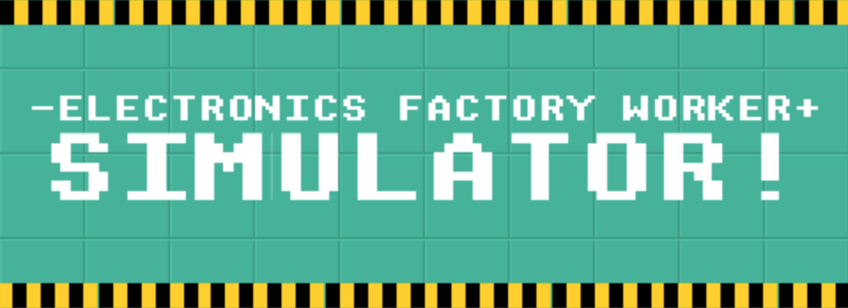
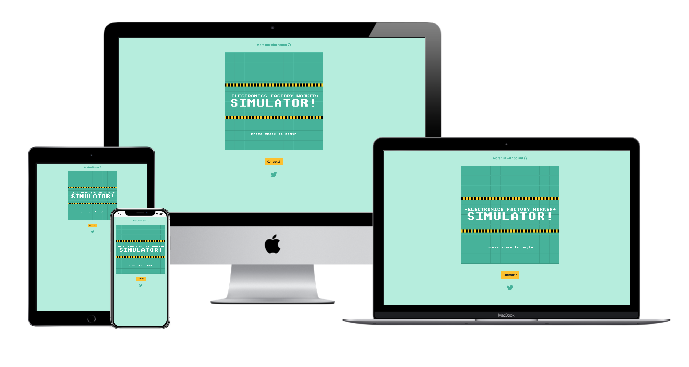

Live game (Desktop Only): http://liamtate.co.uk/efws/

"The ultimate SIMULATOR experience! Work a real-time 12 hour shift, sleep and then do it all over again! Have an existential crisis!"

Inspired by contrasting experiences: the fun of being locked in too many (videogame) dungeon's as a kid, and the mass exploitation & meaninglessness inherent to Capitalism. LOL!

# GAMEPLAY(?)

Very quickly this game gets very boring.

The core gameplay mechanic is so simple that you want to quit and never come back. In other words: it’s THE WORLD’S GREATEST MEANINGLESS-LABOUR SIMULATOR! 

Somewhat of a meta-experience, if you explore you soon discover that there might be something else to do… (See SPOILERS at the bottom of this page)

I’m not sure if this is bad game or good art but I had fun making it :)

NOTE: The game owes an obvious debt to Zelda but more importantly Ania Kubów/FreeCodeCamp. Following her tutorials (and repurposing the art assets) was essential to understanding how KaboomJS worked, as such some of her code was used and is detailed in the CREDITS at the bottom of this document.
 
 

# PRODUCT SHOT

 
 

# UX

## User Stories

First Time Visitor Goals

>I want to play a silly game!

>I want to understand the controls.

>I want to navigate the site, effortlessly.

 

Returning Visitor Goals

>I want to show a friend this dumb game!

>I want a quick way to get in contact with the creator.

 

Frequent User Goals

> I have a serious procrastination problem.
 
 

## Design
 

Colour Scheme

![reference] (src/images/reference.jpg)

* Heavily inspired by the above, the game uses a restricted colour palette to give the game some element of (oppressive?) uniformity.
 

Typography
* The default pixel text in KaboomJS works just fine but for the website I wanted legibility. The main font is 'Changa' with Sans Serif as the fallback.
 

Wireframes
* Desktop - [Title Screen](src/images/wf1.png), [Main screen](src/images/wf2.png), [HUD fail example](src/images/wf3.png), [HUD success example](src/images/wf4.png), [Worker Interaction](src/images/wf5.png), [Tiolet Break](src/images/wf6.png), [Drag and Drop](src/images/wf7.png), [Swipe mechanic](src/images/wf8.png), [Swipe mechanic success](src/images/wf9.png) 
 
 

# LIBRARIES, FRAMEWORKS & PROGRAMS USED

1. Bootstrap 4.5:
    * Bootstrap was used throughout for layout, buttons etc.
    
2. Google Fonts:
    * Google fonts was used for 'Changa'.
    
3. Font Awesome:
    * Font Awesome was for the top icon and the social media link.
    
4. Visual Studio Code
    * VSC was used for all code creation and pushing to GitHub.
    
5. GitHub:
    * GitHub was used to store the projects code after being pushed from Gitpod.
    
6. Photoshop:
    * Photoshop was used to edit exisitng assets and create new ones.
    
7. Balsamiq:
    * Balsamiq was used to create the wireframes during the design process.

8. KaboomJS:
    * The javascript library KaboomJS was essential for all the game code.
    
8. [Web Formater](https://webformatter.com/):
    * To format my html, css code and Javascript.
 
 

# FEATURES

## Navigation

The site is a single page design with an external link opening in a seperate window/tab.

??????????????????????????????????????????????????????????

Desktop:

The desktop navigation bar sticks to the top of the page throughout the users experience, this is particularly important as at any point they can push the call-to-action button, Support Us.

Mobile:

I didn't want the navigation to be hidden inside a 'burger' menu so choose to lose the 'title' and 'support us' button (and opt for a top banner instead) leaving space for the navigation names to be displayed.
 
 

## Landing page

Quite quickly you get a summary of what the podcast is about, a testimonial, a way to listen/subscribe and the option to support the podcast.

- Listen & Subscribe:

The button opens a Modal with podcast platform options, this keeps the main landing page clean and minimal. 
 
 

## Episodes

There are a few design decision going on here, so i'll go through them one by one:
 
 

- **Patreon**

- The black box at the top is my attempt to recreate what one sees when browsing any given Patreon page, [locked content!]()

- I've used a red small badge, using the Patreon brand colour, and listed various perks as a preview for what a user might read on the Patreon page. 

- Given that there are already quite a few instances of the support button on the page, I decided not to put one below the bullet points and saved it to act as a book-end to the episode section. 
 
 

- **Free episode**

- This follows the same design format but whilst the locked content has a small red badge, this has a monochromatic badge informing the user that it's free. Hyperlinks have been differentiated from the main text with a black colour.
 
 

- **Free playlist**

- Placing the support button alongside the full list of free episodes is an attempt at reciprocity: 'here, have all this free content, it would be great if you could give something back in return' etc.
- For continuity I would liked to have made the playlists border edges curved, whilst easy to do in Chrome Dev Tools, this required some Javascript code that was beyond my understanding (at this point in time).
 
 

## About

I've used the same heading font for their names to tie it to the podcasts title branding. I'd like to add more details to this in time but for now this is all the hosts supplied.
 
 

## Contact

Fairly standard contact form lol. I didn't use the label tag but instead opted for placeholder text to do the job of communicating what each field was for.
 
 

## Footer

The footer is sticky and displays throughout, the social media presence of the podcast is important for generating new listners and potential supporters, hence it is in a prominent place.
 
 
 

# Testing User Stories from User Experience (UX) Section

## First Time Visitor Goals:

>I want to quickly understand the sites purpose and to listen/subscribe.

The header/hero sums up the site with easy access to listen. 

 

>I want to navigate the site, effortlessly, to find content.

The single page design allows quick/intuitive use of the site.

 

>I want to be assured that this is a trustworthy operation, I want access to others opinions/reviews and the social media feeds to see what others are saying.

The five star review (and the Apple podcast site which includes many reviews) and the social media links are all one tap/click away.

 

## Returning Visitor Goals:

>I've decided I want to support the podcast, so want that to be obvious how I do that.

The Patreon links are... everywhere!

 

>I want a quick way to get in contact with the hosts.

The social media and the link to the contact form are displayed at all times.

 

>I want to find social media links.

You're in luck! They never go away!

 

## Frequent User Goals:

>I want to search different topics/episodes I might not have listened to.

Currently the user can scroll the embedded playlist but there is room for major improvement here.

 

>I want to stay up-to-date about the podcast, website etc.

The social media links will do this but a newsletter might serve the user better.

 
 

??????????????????????????????????????????????????????????

# FUTURE EXPANSION

There are numerous ways to improve this experience, from small to large.

SMALL: 

* A Hour/Minutes/Seconds countdown for the shift timer.

* Full touch-device compatibility

* 'Controls?' button is a expand/contract toggle!

* Animations!

* Less music? The game takes a while to load due to the quantity of tracks.

LARGE:

* Extra levels
 
 

# TESTING

## Devices & Browsers

The site was tested on the following devices:

Device | OS | Browser
-------|----|---------
iPhone 8 | iOS 14 | Safari, Ghostery, Firefox 
Macbook Pro | Big Sur | Safari, Firefox, Chrome, Brave
 

## Validator testing

HTML: A few errors detected on the W3C validator but I'm outta time! :/

CSS: No errors were found when passing through the Jigsaw W3C validator.

JS: KaboomJS trips them all up so difficult to know!
 
 

## Lighthouse results

Desktop [View](src/images/lighthouse.png)
 
 

## Known bugs

1. Safari is a big one. Because of the AudioContent API, no sound will play at all! Chrome won't play the title music for the same reason but does work after that.

2. The game doesn't center very well on mobile, but given that this is a Desktop-only experience thats not a surprise! 
 
 

??????????????????????????????????????????????????????????????????????????????
# DEPLOYMENT

To get this code to work on your end I used this dev template:

* [Phaser 3 Template](https://github.com/ourcade/phaser3-parcel-template.git)

Then in Visual Studio Code, open a zsh terminal and type:

npm install kaboom
npm run start // RUN YOUR OWN SERVER
npm run build // TO MAKE A VERSION FOR THE WEB (Production files will be placed in the dist folder. Then upload those files to a web server.)

I have deployed the website to my own ftp/website [here](http://liamtate.co.uk/efws/index.html) using Filezilla to transfer files. I am happy to supply a username & password so you can check the time and date stamp. (I'm hesitant to deploy it to github pages because I'd have to restructure my development folders then push to this repository and I'm concerned it'll break something this close to the deadline. All the deployed files can be found in the /dist folder. ).

However, if I was going to deploy to GitHub pages this is how I would do it:

* GitHub repository > 'Settings' tab > 'Pages' menu
* Source drop-down menu > Select Master Branch > Click Save
 

To clone a repository via HTTPS you could just read [this handy guide](https://docs.github.com/en/github/creating-cloning-and-archiving-repositories/cloning-a-repository-from-github/cloning-a-repository), or following along below:

* Dropdown menu 'Code' > Choose either HTTPS, SSH or CLI
* Click clipboard icon
* Open Terminal > Type: 

        $ git clone https://github.com/YOUR-USERNAME/YOUR-REPOSITORY

* Press Enter:

        $ git clone https://github.com/YOUR-USERNAME/YOUR-REPOSITORY
        > Cloning into `Spoon-Knife`...
        > remote: Counting objects: 10, done.
        > remote: Compressing objects: 100% (8/8), done.
        > remove: Total 10 (delta 1), reused 10 (delta 1)
        > Unpacking objects: 100% (10/10), done.

 

To clone a repository to GitHub Desktop:

* Dropdown menu 'Code' > Open with GitHub Desktop
* Follow the prompts!
 
 

# CREDITS

## Content: 

Following [Ania Kubów/FreeCodeCamp](https://www.youtube.com/watch?v=4OaHB0JbJDI&t=187s) tutorials was essential to understanding KaboomJS, as such some of her code was repurposed and is detailed below. I also took some code from the tutorials on the KaboomJS [website](https://kaboomjs.com/).

* Code:

    - Character interacts with an object that triggers events and updates stats. The ('names') are my own but esstially this is her code:

		collides('spray', 'widget', (k,w) => {
        destroy(w)
        destroy(k)
    
        scoreLabel.value++
        scoreLabel.text = scoreLabel.value

        const obj = add([sprite('cleaned'), pos(240,384), 'cleaned'])
        const overlay = add([sprite('spray'), pos(240,384), 'spray'])

        wait(0.3, () => {
            destroy(overlay)
        })

    - The code to have an object appear outside the character I repurposed for a permenant UI effect:

        player.action(() => {
        scoreLabel.pos = player.pos.add(player.dir.scale(-48)) //tracks/sticks to player
	    })

    - The countdown clock was lifted from her Space Invaders tutorial:

        actualTime.action(() => { /* action is called every frame */
        actualTime.time -= dt() /* delta time since last frame */
        const totalSeconds = actualTime.time
        actualTime.text = totalSeconds.toFixed(0)

    - Strobing colour on 'press start' text: [Source](https://kaboomjs.com/demo#button)

        pressSpace.action(()=> {
        const t = time() * 100;
        pressSpace.color = rgb(
        wave(10, 255, t),
        wave(0, 255, t + 2),
        wave(0, 255, t + 4),
	    )})
 

## Media: 

* The music featured in the game is my own.

# SPOILERS

If you Edit > Select All on the webpage you'll find a message.
On the webpage Right-click > 'Inspect / Inspect Element' > Console. You will find a further message.
Got it yet? Hit the + and - keys for fun times!

The idea, at least for me, is to free the workers by breaking or crashing the actual game by overwhelming the machine(s) #Luddite :D
