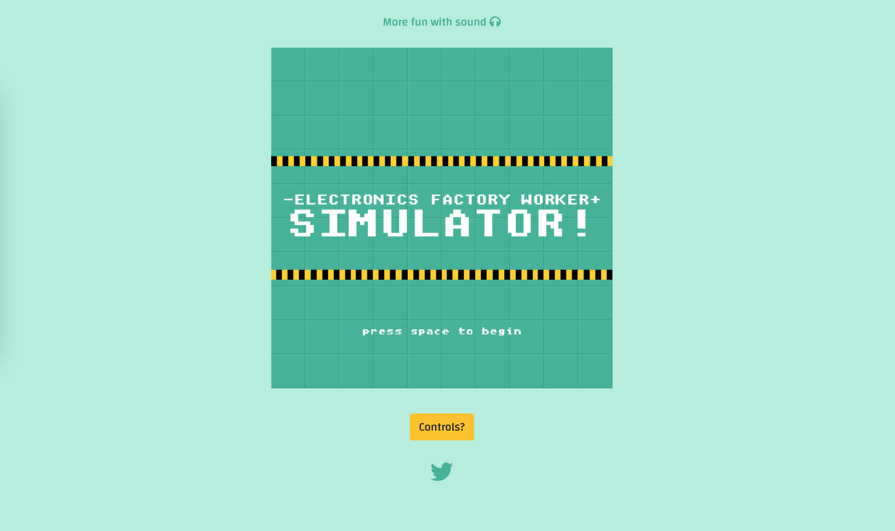
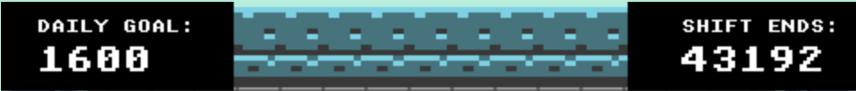
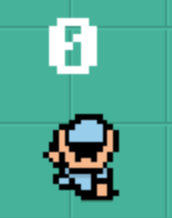
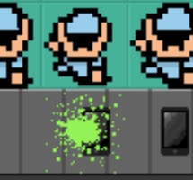
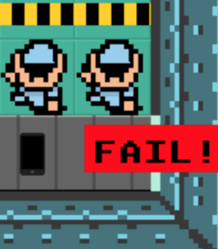
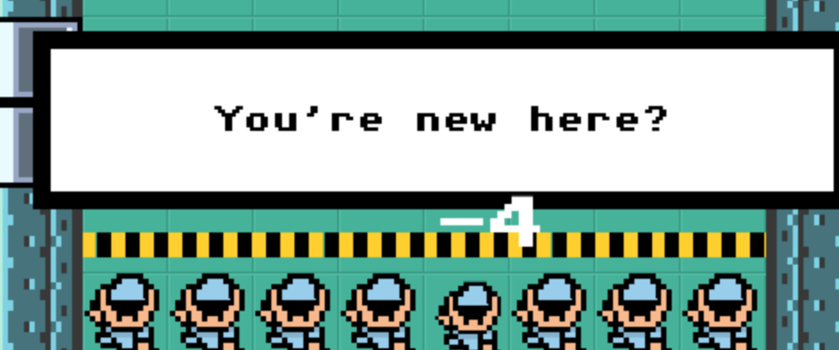

Live game (Desktop Only): http://liamtate.co.uk/efws/

(Recommended browsers: Firefox / Brave / Chrome)

# ABOUT

"The ultimate SIMULATOR experience! Work a real-time 12 hour shift, sleep and then do it all over again! Have an existential crisis!"

Inspired by contrasting experiences: the fun of being locked in too many (videogame) dungeon's as a kid, and the mass exploitation & meaninglessness inherent to Capitalism. LOL!

NOTE: The game owes an obvious debt to Zelda but more importantly Ania Kubów/FreeCodeCamp. Following her tutorials (and repurposing the art assets) was essential to understanding how KaboomJS worked, as such some of her code was used and is detailed in the CREDITS at the bottom of this document.

# GAMEPLAY(?)

Very quickly this game gets very boring.

The core gameplay mechanic is so simple that you want to quit and never come back. In other words: it’s THE WORLD’S GREATEST MEANINGLESS-LABOUR SIMULATOR! 

Somewhat of a meta-experience, if you explore you soon discover that there might be something else to do… (See SPOILERS at the bottom of this page)

I’m not sure if this is bad game or good art but I had fun making it :)
 
 

# PRODUCT SHOT

 
 

# UX

## User Stories

First Time Visitor Goals

>I want to play a silly game!

>I want to understand the controls.

>I want to navigate the site, effortlessly.

 

Returning Visitor Goals

>I want to show a friend this dumb game!

>I want a quick way to get in contact with the creator.

>I want to see what happens when I work the full 12 hour shift.

 

Frequent User Goals

> I have a serious procrastination problem.
 
 

## Design

Colour Scheme
* Heavily inspired by [this](src/images/reference.jpg), the game uses a restricted colour palette to give the game some element of (oppressive?) uniformity.
 

Typography
* The default pixel text in KaboomJS works just fine but for the website I wanted legibility. The main font is 'Changa' with Sans Serif as the fallback.
 

Wireframes
* [Title Screen](src/images/wf1.png)
* [Main screen](src/images/wf2.png)
* [HUD fail example](src/images/wf3.png)
* [HUD success example](src/images/wf4.png)
* [Worker Interaction](src/images/wf5.png)
* [Tiolet Break](src/images/wf6.png)
* [Drag and Drop](src/images/wf7.png)
* [Swipe mechanic](src/images/wf8.png)
* [Swipe mechanic success](src/images/wf9.png) 
 
 

# LIBRARIES, FRAMEWORKS & PROGRAMS USED

1. Bootstrap 4.5:
    * Bootstrap was used throughout for layout, buttons etc.
    
2. Google Fonts:
    * Google fonts was used for 'Changa'.
    
3. Font Awesome:
    * Font Awesome was for the top icon and the social media link.
    
4. Visual Studio Code
    * VSC was used for all code creation and pushing to GitHub.
    
5. GitHub:
    * GitHub was used to store the projects code after being pushed from Gitpod.
    
6. Photoshop:
    * Photoshop was used to edit exisitng assets and create new ones.
    
7. Balsamiq:
    * Balsamiq was used to create the wireframes during the design process.

8. KaboomJS:
    * The javascript library KaboomJS was essential for all the game code.
    
8. [Web Formater](https://webformatter.com/):
    * To format my html, css code and Javascript.

9. Dev template:
    * [Phaser 3 Template](https://github.com/ourcade/phaser3-parcel-template.git) for VSC for development. 
 
 

# FEATURES 

## Landing page

 
Simple and straightfoward. Not cluttered and just focused on the game experience.

## Top HUD

 
The 1600 is a reference to real targets that 'cleaners' have for iPhones. 
A better display would have been Hour / Minutes / Seconds but I couldn't figure it out!

## Player HUD

 
Oversized and overbearing, permenatly displayed above your head, a signifier of your value lol.

## Spray

 
A toxic chemical that makes the phones nice and shiny.

## Fail!

 
If you don't do your one job properly, the machine will shake!

## Chat!

 
The only thing worth doing XD
 
 

# Testing User Stories from User Experience (UX) Section

## First Time Visitor Goals:

>I want to play a silly game!

Well it's silly but whether it's fun...

 

>I want to understand the controls.

For those that don't like to figure things out, there is a button!

 

>I want to navigate the site, effortlessly.

You're in luck! It's so basic and straight forward!

 

## Returning Visitor Goals:

>I want to show a friend this dumb game!

It's still dumb!

 

>I want a quick way to get in contact with the creator.

The social media link is right there!

>I want to see what happens when I work the full 12 hour shift.

It's really disappointing and a waste of time. Meta.

 

## Frequent User Goals:

>I have a serious procrastination problem.

Maybe time is to be wasted?
 
 

# FUTURE EXPANSION

There are numerous ways to improve this experience, from small to large.

SMALL: 

* A Hour/Minutes/Seconds countdown for the shift timer.

* Full touch-device compatibility.

* 'Controls?' button is toggle that expands & contracts.

* Less music? The game takes a while to load due to the quantity of tracks.

LARGE:

* Animations! Animated characters and actions would lift the experience.

* Tiolet break! As in the wireframes, the ability to go to the tiolet and cry would make this extra joyful.
 
 

# TESTING

## Devices & Browsers

The site was tested on the following devices:

Device | OS | Browser
-------|----|---------
iPhone 8 | iOS 14 | Safari, Ghostery, Firefox 
Macbook Pro | Big Sur | Safari, Firefox, Chrome, Brave
 

iPhone 8 couldn't fit the whole game on the screen and was missing vital controls. But it's a desktop experience so...

The fixed width nature of the game means that testing in browsers has been relatively straight forward, the main issue for desktop was keeping the game centered on the page. This was achieved with this css magic formula:

    display: flex;
    justify-content: center;
    align-items: center;

KaboomJS has worked flawlessly across all the browsers I tested it on however the AudioContent issue addressed in 'Known Bugs' remains a problem to solve.

## Validator testing

HTML: A few errors detected on the W3C validator but I'm outta time! :/

CSS: No errors were found when passing through the Jigsaw W3C validator.

JS: KaboomJS trips 'Jshint' up on almost every line so difficult to know :/
 
 

## Lighthouse results

Desktop [View](src/images/lighthouse.png)
 
 

## Known bugs

1. Safari is a big one. Because of the AudioContent API, no sound will play at all! Chrome won't play the title music for the same reason but does work after that.
 
 

# DEPLOYMENT

To get this code to work on your machine I used this dev template:

* [Phaser 3 Template](https://github.com/ourcade/phaser3-parcel-template.git)

Then in Visual Studio Code, open a zsh terminal and type:

    npm install kaboom

    npm run start // RUN YOUR OWN SERVER

    npm run build // TO MAKE A VERSION FOR THE WEB (Production files will be placed in the dist folder. Then upload those files to a web server.)

I have deployed the game to my own ftp/website [here](http://liamtate.co.uk/efws/index.html) using Filezilla to transfer files. I am happy to supply a username & password so you can check the time and date stamp. (I'm hesitant to deploy it to github pages because I'd have to restructure my development folders then push to this repository and I'm concerned it'll break something this close to the deadline. All the deployed files can be found in the /dist folder).

However, if I was going to deploy to GitHub pages this is how I would do it:

* GitHub repository > 'Settings' tab > 'Pages' menu
* Source drop-down menu > Select Master Branch > Click Save
 

To clone a repository via HTTPS you could just read [this handy guide](https://docs.github.com/en/github/creating-cloning-and-archiving-repositories/cloning-a-repository-from-github/cloning-a-repository), or following along below:

* Dropdown menu 'Code' > Choose either HTTPS, SSH or CLI
* Click clipboard icon
* Open Terminal > Type: 

        $ git clone https://github.com/YOUR-USERNAME/YOUR-REPOSITORY

* Press Enter:

        $ git clone https://github.com/YOUR-USERNAME/YOUR-REPOSITORY
        > Cloning into `Spoon-Knife`...
        > remote: Counting objects: 10, done.
        > remote: Compressing objects: 100% (8/8), done.
        > remove: Total 10 (delta 1), reused 10 (delta 1)
        > Unpacking objects: 100% (10/10), done.

 

To clone a repository to GitHub Desktop:

* Dropdown menu 'Code' > Open with GitHub Desktop
* Follow the prompts!
 
 

# CREDITS

## Code: 

Following [Ania Kubów/FreeCodeCamp](https://www.youtube.com/watch?v=4OaHB0JbJDI&t=187s) tutorials was essential to understanding KaboomJS, as such some of her code was repurposed and is detailed below. I also took some code from the tutorials on the KaboomJS [website](https://kaboomjs.com/).

    - Character interacts with an object that triggers events and updates stats. The ('names') are my own but esstially this is her code:

		collides('spray', 'widget', (k,w) => {
            destroy(w)
            destroy(k)
        
            scoreLabel.value++
            scoreLabel.text = scoreLabel.value

            const obj = add([sprite('cleaned'), pos(240,384), 'cleaned'])
            const overlay = add([sprite('spray'), pos(240,384), 'spray'])

            wait(0.3, () => {
                destroy(overlay)
        })

    - The code to have an object appear outside the character I repurposed for a permenant UI effect:

        player.action(() => {
            scoreLabel.pos = player.pos.add(player.dir.scale(-48)) //tracks/sticks to player
	    })

    - The countdown clock was lifted from her Space Invaders tutorial:

        actualTime.action(() => { /* action is called every frame */
        actualTime.time -= dt() /* delta time since last frame */
        const totalSeconds = actualTime.time
        actualTime.text = totalSeconds.toFixed(0)

    - Strobing colour on 'press start' text: [Source](https://kaboomjs.com/demo#button)

        pressSpace.action(()=> {
        const t = time() * 100;
        pressSpace.color = rgb(
        wave(10, 255, t),
        wave(0, 255, t + 2),
        wave(0, 255, t + 4),
	    )})
 

## Media: 

* The music featured in the game is my own.

# SPOILERS

If you Edit > Select All on the webpage you'll find a message.
On the webpage Right-click > 'Inspect / Inspect Element' > Console. You will find a further message.
Got it yet? Hit the + and - keys for fun times!

The idea, at least for me, is to free the workers by breaking or crashing the actual game by overwhelming the machine(s) #Luddite :D
